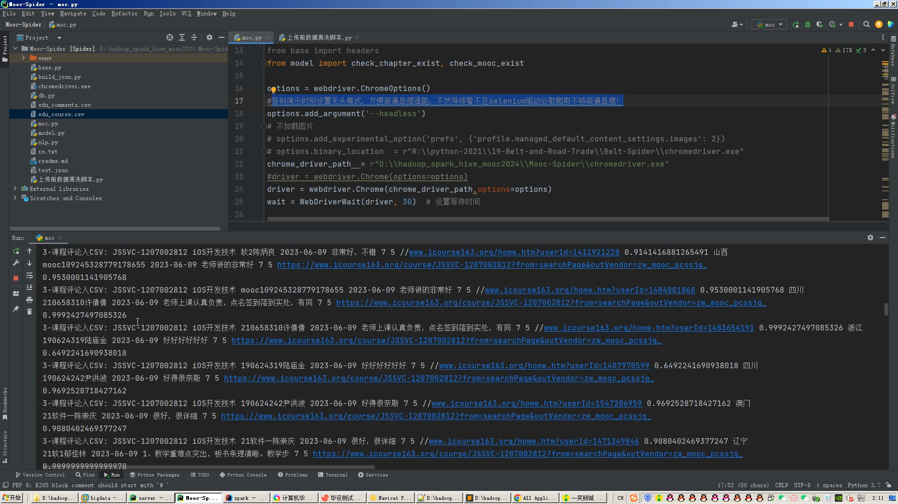

## 计算机毕业设计吊炸天spark+hive+nlp慕课Mooc在线教育课程数据分析可视化大屏 知识图谱课程推荐系统 课程爬虫 文本分类 LSTM情感分析 大数据毕业设计 知识图谱 大数据毕业设计 预测系统 实时计算 离线计算 数据仓库 人工智能 神经网络

## 要求
### 源码有偿！一套(论文 PPT 源码+sql脚本+教程)

### 
### 加好友前帮忙start一下，并备注github有偿hive慕课
### 我的QQ号是2827724252或者798059319或者 1679232425或者微信:bysj2023nb

# 

### 加qq好友说明（被部分 网友整得心力交瘁）：
    1.加好友务必按照格式备注
    2.避免浪费各自的时间！
    3.当“客服”不容易，repo 主是体面人，不爆粗，性格好，文明人。

基础版，也就是当前下面连接这个版本(只带hadoop spark hive flask selenium echarts大屏可视化驾驶舱)

https://www.bilibili.com/video/BV1HV4y1Y7Tb/?spm_id_from=333.999.0.0

## 开发技术：
spark hadoop hive 装杯显摆虚拟机Linux敲命令炫酷吊打 flask echarts sqoop scala hdfs yarn mysql selenium爬虫框架等；

## 流程： 

selenium爬取慕课网的课程、章节、评论数据集分别存两个地方：mysql数据库[便于后期选装推荐、预测算法、知识图谱、后台]、.csv文件；
【需要注意的是慕课网评分不准，需要使用深度学习知识NLP模型进行文本分类、情感分析！！！】

将.csv上传到hdfs中，并使用hive建表后导入.csv数据；

9个指标，一半使用spark/scala去做实时计算分析。一半使用hive_sql进行分层离线处理计算，并使用sqoop把hive分析结果导入mysql;

最终使用flask+echarts制作可视化统计大屏图；

## 创新点：
NLP模型进行文本分类情感分析、Python爬虫采集50万+数据集、可视化大屏、spark+hive离线计算实时计算混合开发双实现防止被导师喷

如果他(导师)还是狂喷不止，继续选择以下的系统，他们可以选装牛鼻功能！

## 可选装项目模块如下：
1.推荐系统(4种深度学习推荐算法 协同过滤基于用户 基于物品 SVD神经网络 MLP)。附带AI、支付、短信、lstm情感分析。
2.预测系统(KNN CNN RNN卷积神经预测 K-means 线性回归)。
3.知识图谱neo4j可视化关系网络图。
4.后台管理系统。

注意：以上1234部分均采用springboot+vue.js前后端分离架构！！！
选装视频效果如下：
https://www.bilibili.com/video/BV1pP411B7wz/?spm_id_from=333.999.0.0
https://www.bilibili.com/video/BV1mh4y1g758/?spm_id_from=333.999.0.0

## 注意：如果导师或者你个人还觉的这个项目工作量不够，可以选装推荐系统、预测系统、知识图谱、后台管理，我保证无缝衔接1秒内安装+选装成功！
## 因为下面的系统和现在的可视化系统是姊妹关系，共用数据库表、CSV等，直接可以对接上！如下↓：

## 可选装：如果你的老师还是喜欢狂喷你，那么你可以选装更屌的功能。

            1.推荐系统(4种深度学习推荐算法 协同过滤基于用户 基于物品 SVD神经网络 MLP)。附带AI、支付、短信、lstm情感分析。

            2.预测系统(KNN CNN RNN卷积神经预测 K-means 线性回归)。

            3.知识图谱neo4j可视化关系网络图。

            4.后台管理系统。

注意：以上1234部分均采用springboot+vue.js前后端分离架构！！！

此系统(慕课课程可视化)属于对之前的spark+springboot+vue课程推荐+预测系统+知识图谱的补充，增加了虚拟机hadoop spark hive操作

防止导师喷人

如果你有了我这个hadoop+spark+hive虚拟机版本大屏以后，老师喷你没有推荐算法预测算法知识图谱

那么可以直接无缝衔接对接上上面的(spark+springboot+vue课程推荐+预测系统)

这个系统我搜索出给大家看

https://www.bilibili.com/video/BV1pP411B7wz/?spm_id_from=333.999.0.0
https://www.bilibili.com/video/BV1mh4y1g758/?spm_id_from=333.999.0.0
我这个虚拟机版本(慕课课程可视化)的大屏可以直接选装装spark+springboot+vue美食推荐+预测系统+知识图谱 

原因因为我做了解耦和，项目可插拔，表之间可以通用！！！！

